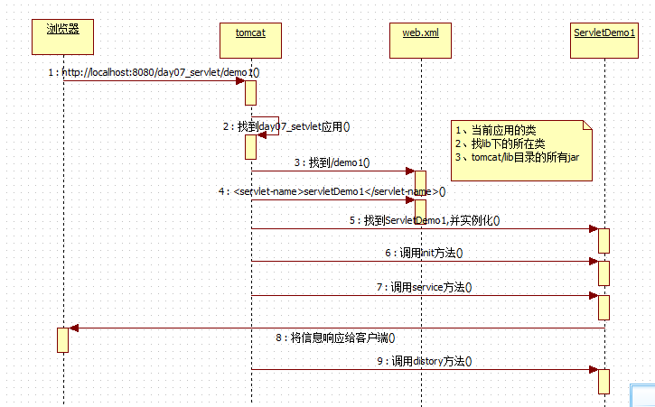
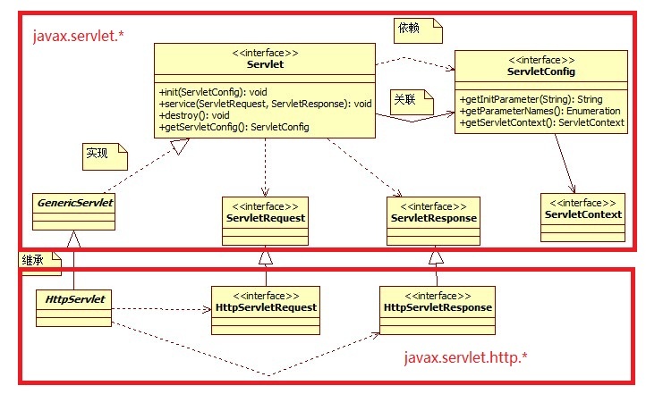

# Servlet

## 执行过程


## 核心类图


## Servlet生命周期

- 出生：（实例化-->初始化）第一次访问Servlet就出生（默认情况下）init()
- 活着：（服务）应用活着，servlet就活着 service()
- 死亡：（销毁）应用卸载了servlet就销毁。destroy()

## Servlet实现方式

- javax.servlet.Servlet接口（参见：编写一个servlet程序：）

- 继承javax.servlet.GenericServlet类(适配器模式)
 
- 继承javax.servlet.http.HttpServlet类（模板方法设计模式）
    - 常用
    - 不需要重写service()
    
## Servlet线程安全
    
- 线程同步与互斥

## Servlet线程同步

## ServletConfig

## ServletContext

- 单实例，代表当前整个应用对象

## Servlet资源路径

```java
public class SourcePath extends HttpServlet {
    protected void doPost(HttpServletRequest request, HttpServletResponse response) throws ServletException, IOException {

    }

    protected void doGet(HttpServletRequest request, HttpServletResponse response) throws ServletException, IOException {
        //Servlet资源路径
        String path1 = "/WEB-INF/test.pro";
        path1 = "/WEB-INF/classes/test.pro";
        String absolutePath = this.getServletContext().getRealPath(path1);
        System.out.println(absolutePath);
        //创建Properties
        Properties properties = new Properties();
        properties.load(new FileInputStream(absolutePath));
        System.out.println(properties.getProperty("name"));
    }
}
```

## Servlet请求转发

```java
public class ServletDispatch extends HttpServlet {
    protected void doPost(HttpServletRequest request, HttpServletResponse response) throws ServletException, IOException {

    }

    protected void doGet(HttpServletRequest request, HttpServletResponse response) throws ServletException, IOException {
        System.out.println("Dispatch source.");

        ServletContext application = this.getServletContext();
        application.getRequestDispatcher("/dispatch/test").forward(request,response);
        System.out.println("Dispatch Done.");
    }
}
```

## HttpServletResponse

- 结构
    - 响应行
    - 响应头
    - 响应正文
- 编码 服务器 客户端
- 字节流 字符流 输出

```java
write(string);
getOutputStream().write(string.getBytes());
```

- 图片验证码
- 浏览器刷新 缓存 下载 ......

### Others

## HttpServletRequest

- 结构
    - 请求行
    - 请求消息头
    - 请求正文

### 请求正文

- 表单数据
    - getParameter(name) 根据表单中name属性的名，获取value属性的值方法 
    - getParameterValues（String name）专业为复选框取取提供的方法
    - getParameterNames() 得到表单提交的所有name的方法 
    - **_getParameterMap 到表单提交的所有值的方法_**
        - 反射 
        - BeanUtils
    - getInputStream  以字节流的方式得到所有表单数据
- 与操作非表单数据相关的方法(request也是一个域对象)
    - void setAttribute(String name, Object value);
    - object getAttribute(String name);
    - void removeAttribute(String name);

### 请求转发与重定向

- forward
- include

## 编码问题


```java
public class ServletInputStreamDemo extends HttpServlet {

	public void doGet(HttpServletRequest request, HttpServletResponse response)
			throws ServletException, IOException {
		request.setCharacterEncoding("UTF-8");
		//获取表单数据
		ServletInputStream sis = request.getInputStream();
		int len = 0;
		byte[] b = new byte[1024];
		while((len=sis.read(b))!=-1){
			//System.out.println(new String(new String(b,0,len).getBytes(),"utf-8"));
			System.out.println(new String(b, 0, len, "UTF-8"));
		}
		
		sis.close();
	}

	public void doPost(HttpServletRequest request, HttpServletResponse response)
			throws ServletException, IOException {
		doGet(request, response);
	}

}

```


## Others

### 内省 反射 匿名内部类

#### BeanUtils类

- ConvertUtils

```java
public class Beanutil extends HttpServlet {
    protected void doPost(HttpServletRequest request, HttpServletResponse response) throws ServletException, IOException {

    }

    protected void doGet(HttpServletRequest request, HttpServletResponse response) throws ServletException, IOException {
        Student stu = new Student();


        try {
            BeanUtils.setProperty(stu,"name","高勇");
            BeanUtils.setProperty(stu,"age","22");
            
            //注册类型转换器
            ConvertUtils.register(new DateLocaleConverter(),Date.class);
            BeanUtils.setProperty(stu,"birthday","1995-05-20");
        } catch (IllegalAccessException e) {
            e.printStackTrace();
        } catch (InvocationTargetException e) {
            e.printStackTrace();
        }

        System.out.println(stu.getName() + stu.getAge());
    }
}
```


